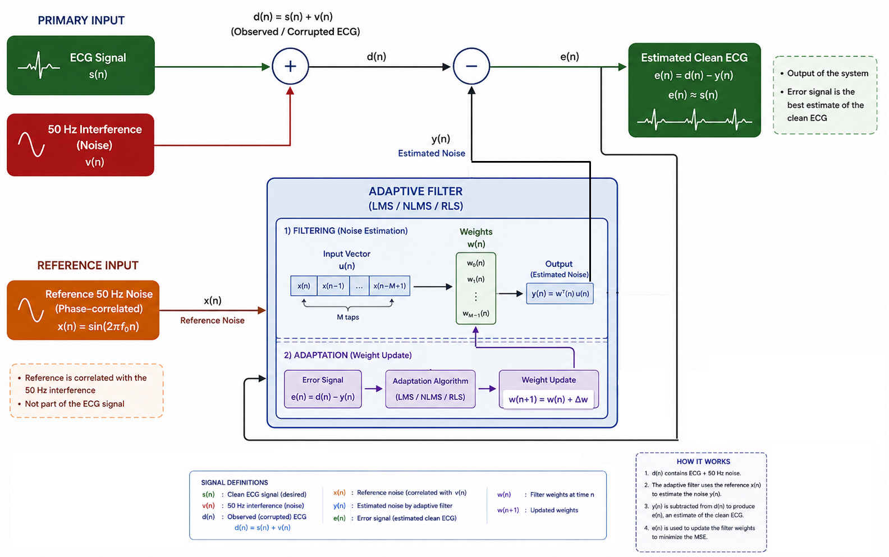

# Adaptive Noise Cancellation on Real ECG Signals
### A Comparative Study of LMS, NLMS, and RLS Algorithms

**Course:** ECOM 9303 — Digital Signal Processing | **IUG** | **Author:** Ahmad Fouad El Samak | **Supervisor:** Prof. Ammar Abu-Hudrouss | 2026

---

## Project Overview

This project implements and compares three adaptive filtering algorithms — **LMS**, **NLMS**, and **RLS** — for 50 Hz power-line noise cancellation on real clinical ECG recordings from the **MIT-BIH Arrhythmia Database**. Each algorithm is deployed within a two-input Adaptive Noise Cancellation (ANC) architecture:



```
Primary:    d(n) = s(n) + v(n)  →  [ Σ ]  →  e(n) ≈ s(n)  [Clean ECG]
                                       ↑
Reference:  x(n) = sin(2πf₀n)  →  [ Adaptive Filter ]  →  y(n)
                                    LMS / NLMS / RLS
                                         ↑
                                   [ Weight Update ]  ←  e(n)
```

---

## How to Run

### Option 1 — Google Colab (Recommended)

1. Open [colab.research.google.com](https://colab.research.google.com)
2. Upload `DSP_Adaptive_Filter_LMS_NLMS_RLS.ipynb`
3. Run **Runtime → Run all**

> All dependencies install automatically in Section 1.

### Option 2 — Local

```bash
pip install wfdb numpy scipy matplotlib
jupyter notebook DSP_Adaptive_Filter_LMS_NLMS_RLS.ipynb
```

> MIT-BIH data downloads automatically from PhysioNet — no manual download needed.

---

## Notebook Sections

| Section | Content |
|---------|---------|
| 1 | Installation & imports |
| 2 | Data loading — MIT-BIH Records 100, 106, 200 |
| 3 | Noise injection — 50 Hz at SNR = 10 dB |
| 4 | LMS algorithm implementation |
| 5 | NLMS algorithm implementation |
| 6 | RLS algorithm implementation |
| 7 | Run all algorithms + compute metrics |
| 8 | Group A figures — signal progression |
| 9 | Group B figures — per-algorithm characteristics |
| 10 | Group C figures — final comparison |
| 11 | Results summary + theoretical validation |

---

## Requirements

```bash
pip install wfdb numpy scipy matplotlib
```

| Package | Purpose |
|---------|---------|
| `wfdb` | MIT-BIH data loading from PhysioNet |
| `numpy` | Numerical computation |
| `scipy` | Pearson correlation |
| `matplotlib` | Plotting |

---

<div align="center">
  <sub>Islamic University of Gaza — Faculty of Engineering — Spring 2026</sub>
</div>
